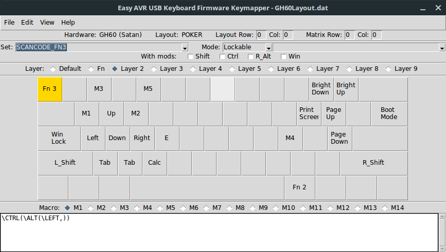
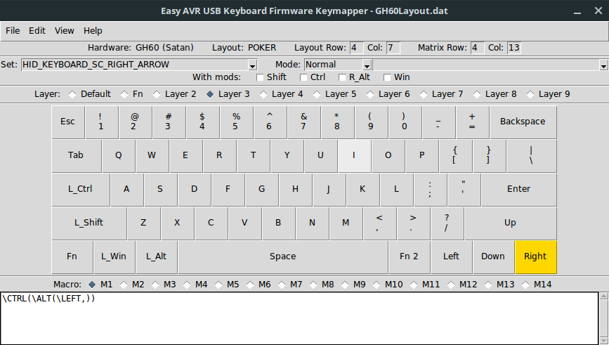

# Setup #

Install [Easy AVR](https://github.com/dhowland/EasyAVR) in order to generate a `.hex` file.

Remember to install the prerequisites to the board that you are going to flash.

When you have a layout for your board build the firmware to the same directory as the flashing script.

# Flash #
Before flashing make sure you look at the source code of [flashgh60.sh](./flashgh60.sh) before giving it root access. the `dfuprogrammer` needs root access to flash the board. I usually just take the time at this point to install any system updates.

When flashing the GH60 Satan run the following command
```
    ./flashgh60.sh *.hex
```
in the directory where you built your firmware
It will give you 5 seconds to switch the board into boot mode
(this can be done by mapping a key to set the board into boot mode or hitting the button on the back of the board)
It will then erase the board, flash it and reset the board.

# My layout #

If you do decide to use my layout for some strange reason here is what you will be greeted with:

## Default Layer ##


- Dvorak
- Removed Caps and made it Control
- Replaced normal Control with button to Fn layer

## Fn Layer ##


## Fn2 Layer ##



## Fn3 Layer ##



- Qwerty
- For gaming/plebs
